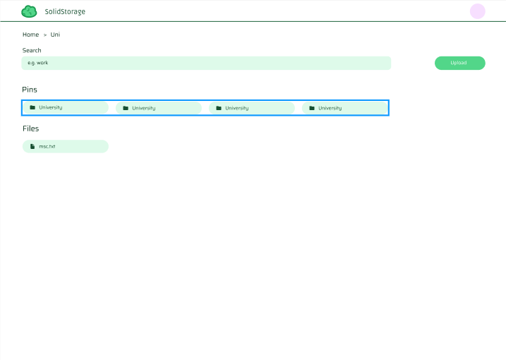

# Overview

This is the code for the frontend of my cloud storage app. The backend can be found [here](https://github.com/RaksaRS/solidstore-be).

# UI

Light (Figma design): 
Dark (Figma design): 

# Functionality

- By itself, the website runs on HTTP, but in development, I was able to get it running HTTPS by using [Caddy server](https://caddyserver.com/). HTTPS is recommended if Auth0 is used to ensure bugs don't persist.
- Folder Navigation
- Folder/file creation/deletion
- Authentication implemented via Auth0
- Dark mode
- Most components are React Server Components

Back-end architecture can be found [here](https://github.com/RaksaRS/solidstore-be).

### Current Issues:

- Users can't change accounts: After calling /api/logout, the session cookie remains in the browser, and on the next visit, the user is logged in automatically using this session, which prevents users from logging in with different credentials
- Dark mode isn't fully functional yet
